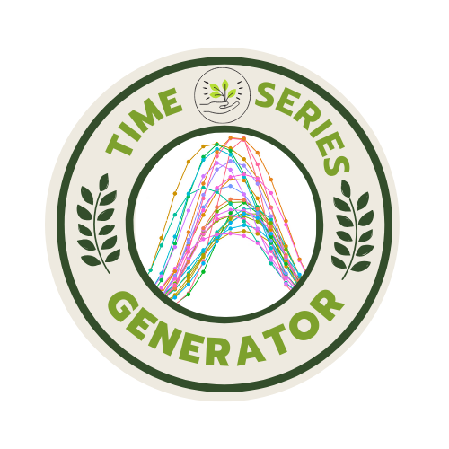
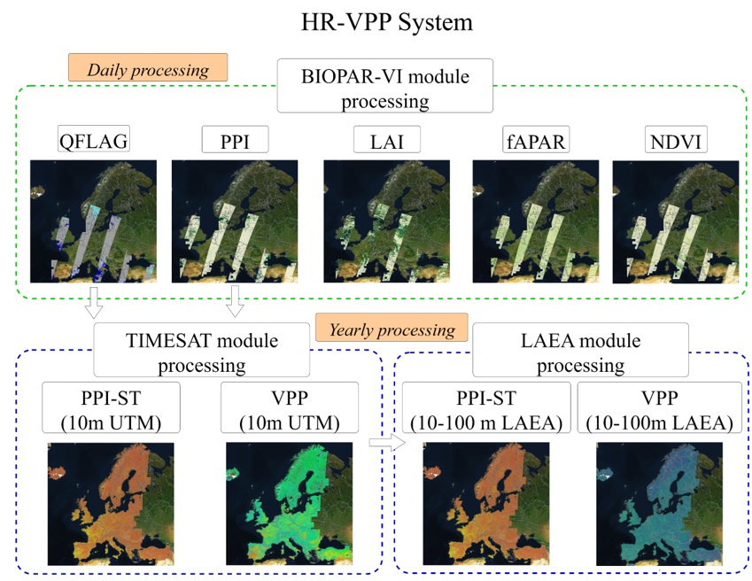
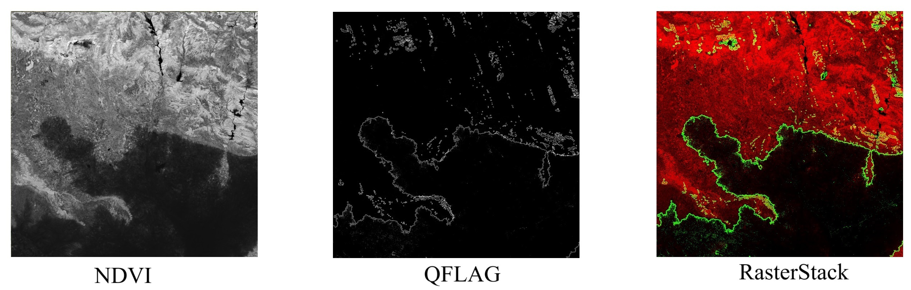
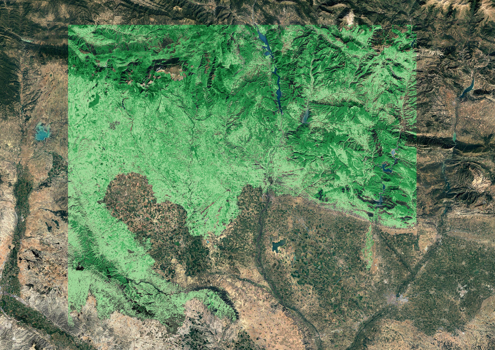
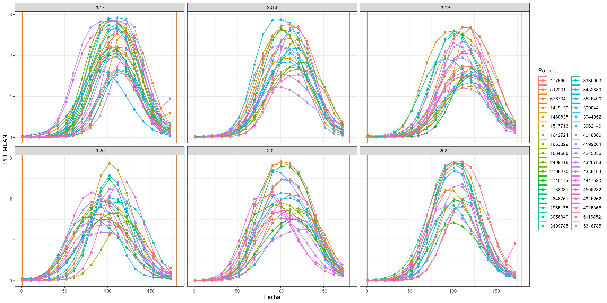
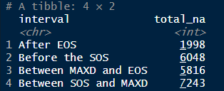
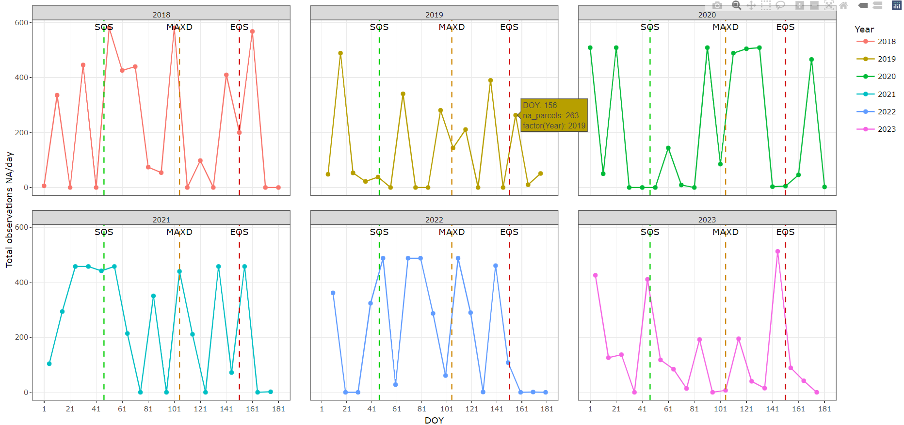
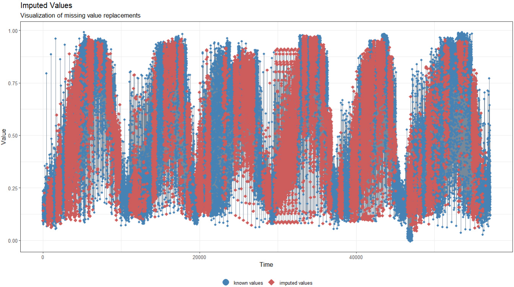
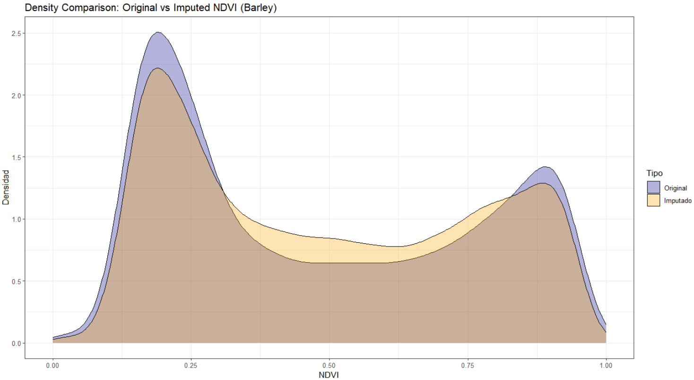

# TSGenerator


**TSGenerator** is an R package designed to facilitate the generation and time series analysis of Copernicus HR-VPP products. This package includes functions for data imputation, analysis and visualization.

Within the pan-European component the Copernicus Land Monitoring Service produces and disseminates a set of products with high spatial resolution on phenology and vegetation productivity  10 m^{2}  and high repetition frequency (WEkEO, 2021; Eklundh et al., 2023; Goihl, 2023). These products are derived from the Sentinel-2 satellite constellation (2A and 2B) and cover 32 EU member countries, UK and 6 cooperating countries of the Western Balkans since January 2017 with daily, decadal and annual frequency. Thirty-one types of HR-VPP products are contained in three groups, a total of 1522 files and more than 900 000 mosaics per year, totaling a volume of 80 Tera bytes per year. These data are free of charge and freely accessible through the WEkEO Data and Information Access Service.



## Author and collaborators
**Author:** *MSc.Alexey Valero Jorge* (1) 

**Email:** avalero@cita-aragon.es

**Contributor:** *Dr. José Tomás Alcalá* (2)

**Contributor:** *Dra. Ma. Auxiliadora Casterad* (1)


### Affiliations

1 Departamento de Sistemas Agrarios, Silvicultura y Medio Ambiente (Unidad asociada a suelos y riego de la EEAD-CSIC), Centro de Investigación y Tecnología Agroalimentaria de Aragón (CITA)

2 Facultad de Ciencias de la Universidad de Zaragoza; Instituto de Investigación de Matemáticas y Aplicaciones (IUMA), Universidad de Zaragoza

## Table of Contents

- [Installation](#installation)
- [Use](#use)
- [Main Functions](#functions-main)
- [Examples](#examples)
- [Contributions](#contributions)
- [License](#license)
- [Financing](#financing)
- [References](#references)

## Installation

You can install the package directly from GitHub using the following code:

```r
# Install devtools if you do not have it
install.packages("devtools")

# Install TSGenerator from GitHub
devtools::install_github("avalero92/TSGenerator")
```

## Use

This tool uses certain Python libraries to function properly. Before you can use the TSGenerator package, you must make sure you have the following Python libraries installed:

- hda (Harmonized Data Acces): For more information on HDA-API developed by WEkEO see: https://help.wekeo.eu/en/articles/9515753-what-is-the-harmonized-data-access-hda-api

In order to interoperate with the Python environment in R, be sure to install the **reticulate** package (Ushey et al., 2024).

## Main Functions

The main functions of TSGenerator are grouped into several modules which are presented below:

### Download module
 1- **Download.HRVPP** function: it is used for the discharge of the different products of phenology and productivity of the vegetation.
 
 2- **Download.VI** function: it is used for downloading the different raw vegetation indices (NDVI, LAI, fAPAR and PPI) and the quality product QFLAG2.
 
 3- **Download.STPPI** function : is used to download the seasonal trajectories of the PPI.

### Preprocessing module

 1- **getStack** function: this function searches for .TIFF files of vegetation indexes (VI) in a specified directory, and for each IV file, it tries to find a QFLAG file corresponding to its date. As a result, it generates a new raster-stack file. 
 
 2- **getCleanIV** function: from the created raster-stack files, noisy pixels are removed from the IV images (clouds, cloud shadows, water, etc.), using the QFLAG2 product as a criterion (values != 1 are considered noisy).

### Time series extraction


1- **get.Series.mean** function: used to extract the average time series of the IVs from a shapefile of the area of interest.

2- **get.Series.median** function: used to extract the median time series of the IVs from a shapefile of the area of interest.

3- **get.Series.VPP** function: is used to extract median phenology and productivity data from Copernicus (SOS, EOS, MAX, etc).

### Missing data analysis and visualization

1- **general.Quality** function: is used to obtain the average percentage of the quality of all time series (in case of multiple time series) as a function of the number of observations in each series.

2- **count.NA** function: aims to count and visualize the number of NA values in a dataset related to plot observations over time.


## Examples

```r
# It is necessary to configure the PATH where python.exe and the hda module are located by creating the object "ruta_python".
ruta_python <- "PATH/python.exe" # replace "PATH" with the path to the directorywhere the python executable is located

# Use of the "Download.VI" function
Download.VI(
user = "user_name", # replace "user_name" with the user registered in the WEkEO platform
password = "Password", # replace "password" with the password connected to the same user
dataset_id = "EO:EEA:DAT:CLMS_HRVPP_VI", # product identifier
productType = "NDVI", 
platformSerialIdentifier = "S2A",
tileId = "30TXL",
start = "2020-01-01T00:00:00.000Z",
end = "2020-01-10T00:00:00.000Z",
bbox = c(-0.89285, 41.48762, -0.86284, 41.50456),
download_path = "local_directory" # replace with the directory where the data is to be stored
)
```


```r
# Example of use of the get.Stack function

## We declare the function parameters
IV_path <- "C/directory where VI data is located"
QFLAG <- "C/directory where QFLAG data is located"
output_path <- "C/directory where the raster-stacks will be stored"

# We use the function
get.Stack(IV_path, QFLAG, output_path)

```


```r
# Example of the use of the get.CleanIV function

## We declare the function parameters
stack_folder <- "C/path where the raster-stacks files are stored"
output_folder <- "C/path where the new files free of noisy pixels will be stored"

get.Clean.IV(stack_folder, output_folder)

```



To perform the extraction of the time series you must take into account that you must use a shapefile with a geometry of type **polygon**.

```r
# Example of use of the get.Series.median function

## We declare the function parameters
pathRaster <- "C/directory where the .tiff files are located"
shapefile <- shapefile to be used for time series extraction: it can be a single or multipolygon file.
factorR <- 10000 # this is a scaling factor with which the VI values are divided, example:
# NDVI = 25356/10000
# NDVI = 0.25356

series <- get.Series.median(pathRaster = pathRaster, shapefile = shapefile, factorR = factorR)

```


```r
# Example of use of the count.NA function
data <- read.csv(system.file("data", "Barley.csv" ,package = "TSGenerator"),sep = ";")  


sos <- 47  # Replace with your real value
maxd <- 105  # Replace with your real value
eos <- 151  # Replace with your real value

# Call the function with your data
result <- count.NA(data, sos, maxd, eos,doy_col = "DOY", year_col = "Year", na_col = "NDVI", fid_col = "fid")
print(result$interactive_plot)

```
The results of using the count.NA function are stored in a list: an object of type *tibble* showing the count of missing values before and after each phenophase and an object of type *plotly*.





The **Ts.Impute** function is used to impute missing values in a time series by group using the Kalman (Jain and Singh,
2011) smoothing method. An example of how to use the function is shown below. Para profundizar respecto al uso del filtro de Kalman para imputar datos missing ver **na_kalman** del paquete imputeTS (https://rdrr.io/cran/imputeTS/man/na_kalman.html). 

```r
data <- read.csv(system.file("data", "Barley.csv" ,package = "TSGenerator"),sep = ";")  

# Use of the function

data_imputada <- Ts.Impute(data, "fid", "NDVI")
#:::::::::::::::::::::::::::::::::::::::::::::::::::::::::::::
# Plot of actual and imputed data using the ggplot_na_imputations function of the imputeTS package.
ggplot_na_imputations(data$NDVI,data_imputada$NDVI_completed,
                      theme = ggplot2::theme_bw())
```


```r
# Create a data frame for comparison
comparison_ndvi <- data.frame(
  Original = data_imputada$NDVI,
  Imputado = data_imputada$NDVI_completed
)

# Combines original and imputed data
data_comparacion <- data.frame(
  NDVI = c(data$NDVI, data_imputada$NDVI_completed),
  Tipo = rep(c("Original", "Imputado"), each = nrow(data))
)

# Create the boxplot
ggplot(data_comparacion, aes(x = Tipo, y = NDVI)) +
  geom_boxplot(na.rm = FALSE) +
  labs(title = "Comparison of Original and Imputed NDVI",
       x = "NDVI type",
       y = "NDVI values") +
  theme_bw()


# Transform the data frame for density comparison
comparison_long <- reshape2::melt(comparison_ndvi)

ggplot(comparison_long, aes(x = value, fill = variable)) +
  geom_density(alpha = 0.3, na.rm = FALSE) +
  labs(title = "Density Comparison: Original vs Imputed NDVI (Barley)",
       x = "NDVI",
       y = "Densidad") +
  scale_fill_manual(name = "Tipo", values = c("Original" = "blue4", "Imputado" = "orange")) +
  xlim(0, 1) +
  theme_bw()

```



## License

This project is licensed under the MIT License. See the LICENSE file for more details.

## Financing

The **TSGenerator** package was created within the LAIcKA, I+D+i project *PID2021-124029OR-I00*, funded by MICIU/AEI/10.13039/501100011033 and FEDER/EU.

The author gratefully acknowledges grant *PRE2022-102328* funded by MICIU/AEI/10.13039/501100011033 and FSE+.


## References

CLMS releases HR-VPP product to assess ecosystems and biodiversity. (2021). WEkEO. https://www.wekeo.eu/news/clms-releases-hr-vpp-product-to-assess-ecosystems-and-biodiversity

Eklundh, L., Jin, H., & Cai, Z. (2023). Deliverable. https://crossdro.csic.es/wp-content/uploads/2023/03/

Goihl, S. (2023). Determining the usefulness of the Copernicus High-Resolution Vegetation Phenology and Productivity Product (HR-VPP) with official agricultural data on cropland in case of the 2018 drought in the Federal State of Saxony, Germany. Journal of Water and Climate Change, 14(11), 3931-3949.

Jain, S.K., Singh, S.N., 2011. Harmonics estimation in emerging power system: Key issues and challenges. Electr. Power Syst. Res. 81, 1754 1766.

Kevin Ushey, JJ Allaire, & Yuan Tang. (2024). Reticulate: Interface to «Python». R package version 1.39.0. https://rstudio.github.io/reticulate/
