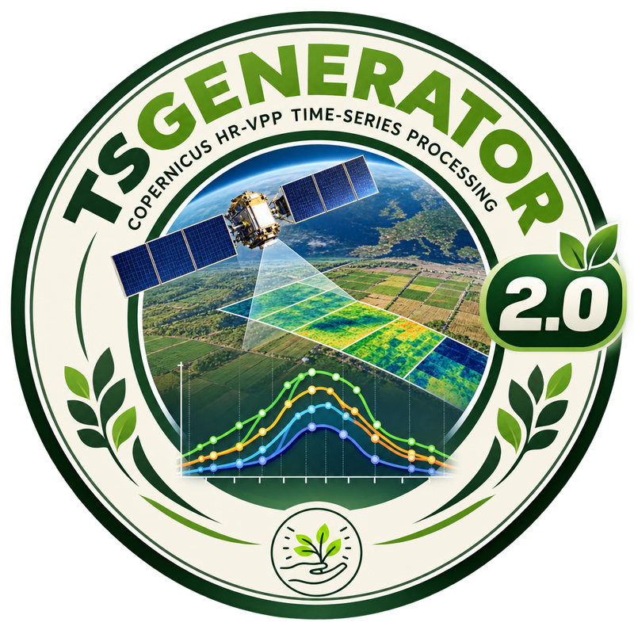

# TSGenerator

<p align="center">
  
</p>

<p align="center">
  <a href="https://doi.org/10.5281/zenodo.14936909"></a>
</p>

**TSGenerator 2.0** is an R package for acquiring, extracting, quality-assessing, and analysing Copernicus HR-VPP **Seasonal Trajectories (ST)** and **Vegetation Phenology and Productivity (VPP)** products.

The 2.0 architecture is built around three explicit components:

- **Acquisition:** native R access to WEkEO HDA through `hdar`.
- **Geospatial processing:** `terra`-based extraction and product-aware quality handling.
- **Time-series analysis:** temporal completeness, optional imputation, and missingness diagnostics.

Python/`reticulate`, `raster`, the discontinued VI workflow, and the old QFLAG2 preprocessing chain are not part of the 2.0 core.

### Unified Shiny application

TSGenerator 2.0 includes a single integrated graphical workflow for users who prefer not to program directly:

```r
library(TSGenerator)
runTSapp()
```

The application follows **Acquire → Prepare/Extract → Quality → Analyze → Export** and calls the same public R API used in scripts. Results & Export records available session outputs, acquisition provenance, reproducible R code, and session information. Selected historical mini-apps remain temporarily callable for compatibility, while discontinued VI/QFLAG2 interfaces are blocked.

## Installation

```r
install.packages("devtools")
devtools::install_github("avalero92/TSGenerator")
```

A WEkEO account is required only for online ST/VPP searches and downloads. Credentials can be supplied to `hda_client()` or managed by `hdar` through `~/.hdarc`.

## Quick start

### 1. Check WEkEO

```r
library(TSGenerator)

check_wekeo()
# For a live authenticated diagnostic:
# check_wekeo(online = TRUE)
```

### 2. Preview or download ST

```r
st_search <- download_st(
  start = "2020-04-01",
  end = "2020-04-30",
  tile_id = "30TXM",
  product = c("PPI", "QFLAG"),
  download = FALSE
)

# Set download = TRUE and output_dir = "HRVPP_ST" to download.
```

`download_st()` uses the current HR-VPP ST dataset and supports PPI and ST-QFLAG. Long requests are divided into service-compatible temporal windows.

### 3. Preview or download VPP

```r
vpp_search <- download_vpp(
  start = "2020-01-01",
  end = "2020-12-31",
  tile_id = "30TXM",
  product = c("SOSD", "MAXD", "EOSD", "LENGTH"),
  season = "s1",
  download = FALSE
)
```

VPP metadata and scaling are handled by product. Date parameters such as SOSD/MAXD/EOSD are not treated like spectral or productivity values.

## Geospatial extraction

### ST time series

```r
st_ts <- extract_ts(
  x = "HRVPP_ST/PPI",
  polygons = parcels,
  id_col = "Parcel_ID",
  fun = "median"
)
```

The result is a tidy `tsg_time_series` with `ID`, `Date`, `Layer`, and `Value`. `extract_ts()` validates polygon IDs and CRS and preserves the source raster grid.

### VPP parameters

```r
vpp <- extract_vpp(
  x = "HRVPP_VPP",
  polygons = parcels,
  id_col = "Parcel_ID",
  fun = "median"
)
```

The result identifies `Year`, `Season`, `Product`, `Unit`, and source `Layer`. Date products populate `Date`; numeric products populate `Value`.

## Product quality

Copernicus product quality is deliberately separate from temporal completeness.

```r
quality_info("ST")
quality_info("VPP")

q_summary <- summarize_quality(qflag, type = "ST")

st_masked <- mask_quality(
  x = st_raster,
  quality = qflag_raster,
  type = "ST",
  min_quality = 4
)
```

Quality flags are categorical. TSGenerator does not bilinearly resample QFLAG rasters.

## Time-series completeness

```r
plan <- temporal_plan(
  st_ts,
  expected_step = 10
)

missing <- summarize_missingness(plan)
quality <- assess_ts_quality(plan)
```

`summarize_missingness()` distinguishes **absent expected dates** from **explicit `NA` values**. `assess_ts_quality()` classifies completeness; its classes are TSGenerator diagnostics and must not be confused with Copernicus QFLAG classes.

## Optional imputation

```r
completed <- impute_ts(
  user_series,
  method = "linear",
  series_type = "user",
  complete_grid = TRUE,
  expected_step = 10,
  max_gap = 2
)
```

ST is already temporally processed, so additional ST imputation is blocked by default. It requires the explicit `allow_processed = TRUE` override when scientifically justified.

## Missingness modelling

```r
fit <- model_missingness(
  missingness_data,
  year_col = "Year",
  doy_col = "DOY",
  value_col = "Value"
)

plot_missingness(fit)
```

The 2.0 API separates the GAM model from plotting. Year is categorical by default and DOY can use a cyclic smooth.

## Main 2.0 API

| Module | Functions |
|---|---|
| WEkEO | `hda_client()`, `check_wekeo()`, `check_wekeo_integration()` |
| Acquisition | `download_st()`, `download_vpp()` |
| Geospatial | `geospatial_plan()`, `extract_ts()`, `extract_vpp()` |
| Product quality | `quality_info()`, `classify_quality()`, `summarize_quality()`, `mask_quality()` |
| Temporal quality | `temporal_plan()`, `summarize_missingness()`, `assess_ts_quality()` |
| Imputation | `impute_ts()` |
| Diagnostics | `model_missingness()`, `plot_missingness()` |
| Apps | `runTSapp()` |

## Migrating from TSGenerator 1.x

The principal replacements are:

| TSGenerator 1.x | TSGenerator 2.0 |
|---|---|
| `Download.STPPI()` | `download_st()` |
| `Download.HRVPP()` | `download_vpp()` |
| `get.Series.mean()` | `extract_ts(..., fun = "mean")` |
| `get.Series.median()` | `extract_ts(..., fun = "median")` |
| `get.Series.VPP()` | `extract_vpp()` |
| `QFLAG2.Mask()` | `mask_quality()` for current ST/VPP QFLAG |
| `quality.Series()` / `general.Quality()` | `summarize_missingness()` / `assess_ts_quality()` |
| `TsImpute()` | `impute_ts()` |
| `GAM.missing()` / `GAM.plot()` | `model_missingness()` / `plot_missingness()` |

The old VI/QFLAG2 workflow (`Download.VI()`, `get.Stack()`, `get.Clean.IV()`, `renames.image.IV()`) is legacy-only because it targets discontinued products/workflows. Historical source is retained under `legacy/` for traceability, not as the recommended 2.0 workflow.

See `vignette("migration-1x-to-2x", package = "TSGenerator")` after installation for the detailed migration guide.

## Validation before release

The development branch includes offline tests and an opt-in live WEkEO integration harness. Maintainers should run:

```r
devtools::document()
testthat::test_local()
devtools::check(document = FALSE, manual = FALSE)

check_wekeo(online = TRUE)
z <- check_wekeo_integration(download = FALSE)
stopifnot(z$ok)
```

A controlled real-download smoke test should also be completed before a release candidate.

## Vignettes

- `vignette("getting-started", package = "TSGenerator")` — architecture and core workflow.
- `vignette("st-vpp-workflows", package = "TSGenerator")` — acquisition-to-analysis examples.
- `vignette("migration-1x-to-2x", package = "TSGenerator")` — detailed 1.x → 2.0 migration.

## Authors and affiliations

- **Alexey Valero-Jorge** — creator and maintainer. ORCID: [0000-0002-5993-7346](https://orcid.org/0000-0002-5993-7346).  
  Departamento de Sistemas Agrícolas, Forestales y Medio Ambiente (Unidad asociada a EEAD-CSIC Suelos y Riegos), Centro de Investigación y Tecnología Agroalimentaria de Aragón (CITA), Avda. Montañana 930, 50059 Zaragoza, Spain.

- **Mª Auxiliadora Casterad Seral** — researcher. ORCID: [0000-0003-4458-6966](https://orcid.org/0000-0003-4458-6966).  
  Departamento de Sistemas Agrícolas, Forestales y Medio Ambiente (Unidad asociada a EEAD-CSIC Suelos y Riegos), Centro de Investigación y Tecnología Agroalimentaria de Aragón (CITA), Avda. Montañana 930, 50059 Zaragoza, Spain.

- **José-Tomás Alcalá Nalvaiz** — researcher. ORCID: [0000-0001-7549-8825](https://orcid.org/0000-0001-7549-8825).  
  Departamento de Métodos Estadísticos, Instituto Universitario de Investigación en Matemáticas y Aplicaciones (IUMA), Universidad de Zaragoza, Zaragoza, Spain.

### Contact

**Alexey Valero-Jorge** — `avalero@cita-aragon.es`

## Citation and DOI

TSGenerator is archived in Zenodo. The current project DOI is **10.5281/zenodo.14936909**.

[](https://doi.org/10.5281/zenodo.14936909)

When using TSGenerator in research, please cite the software and the corresponding archived version. A version-specific DOI for TSGenerator 2.0.0 will be added after the 2.0.0 release is archived in Zenodo.

## Scientific publications

TSGenerator has been presented and applied in scientific research involving Copernicus HR-VPP products and vegetation time-series processing.

### TSGenerator software publication

Valero-Jorge, A., Casterad, M. A., & Alcalá, J.-T. (2026). **TSGenerator: librería R de código abierto para el procesado integrado de productos fenológicos HR-VPP de Copernicus.** *Congresos UEx, Actas de Congresos*, *2*. [https://doi.org/10.17398/3101-7177.2.123](https://doi.org/10.17398/3101-7177.2.123)

### Research using TSGenerator

Valero-Jorge, A., Casterad, M. A., & Alcalá, J.-T. (2025). **Evaluating the Influence of Missing Data from the Crop Vegetation Index Time Series on Copernicus HR-VPP Phenological Products.** *Engineering Proceedings*, *94*(1), 4. [https://doi.org/10.3390/engproc2025094004](https://doi.org/10.3390/engproc2025094004)

## Funding

TSGenerator was created within the LAIKcA I+D+i project PID2021-124029OR-I00, funded by MICIU/AEI/10.13039/501100011033 and FEDER/EU. Alexey Valero Jorge acknowledges grant PRE2022-102328 funded by MICIU/AEI/10.13039/501100011033 and FSE+.

## License

MIT. See `LICENSE`.
